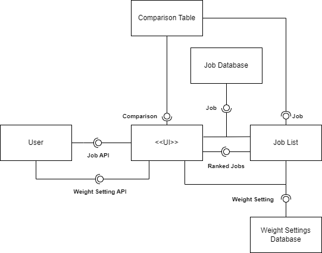

# Design Document

*This is the template for your design document. The parts in italics are concise explanations of what should go in the corresponding sections and should not appear in the final document.*

**Author**: Jessie Luk
## 1 Design Considerations

*The subsections below describe the issues that need to be addressed or resolved prior to or while completing the design, as well as issues that may influence the design process.*

### 1.1 Assumptions

*Describe any assumption, background, or dependencies of the software, its use, the operational environment, or significant project issues.*
* Single user app
* Does not require authentication to access data
* Do not need to sync data with multiple users
* Offline - does not require internet or connection to any external servers; will not communicate externally via platforms such as email or messaging; all capabilities and data are local to device
* User cannot import data and use on another device because app is offline
* All user requirements provided are P0.
* App will be written in English with no translations into other languages
* User only works one current job (does not have multiple jobs)

### 1.2 Constraints

*Describe any constraints on the system that have a significant impact on the design of the system.*
* Time to design and build app from start to finish is about 1 month
* Teammates are in different timezones, which makes coordination difficult
* Pixel 4 XL with Android 11 (API level 30)
* User Feedback - will not be testing on users for feedback and continuous improvements
* Must be written in Java

### 1.3 System Environment

*Describe the hardware and software that the system must operate in and interact with.*
* Device type: smartphone or tablet - Pixel 4 XL or higher
* Screen resolution of 1440x3040 pixels or higher
* 150 MB of free space in the device's main memory
* Operating system: Android 11.0 and later
* Snapdragon 855 chipset and above
* The app must only be installed to the device's main memory.

## 2 Architectural Design

*The architecture provides the high-level design view of a system and provides a basis for more detailed design work. These subsections describe the top-level components of the system you are building and their relationships.*

### 2.1 Component Diagram

*This section should provide and describe a diagram that shows the various components and how they are connected. This diagram shows the logical/functional components of the system, where each component represents a cluster of related functionality. In the case of simple systems, where there is a single component, this diagram may be unnecessary; in these cases, simply state so and concisely state why.*

The user provides the Job and Weight Setting information through the UI via APIs (in the form of a userform). The UI will take the Job and Weight Settings and store them in the appropriate database. The Job List will need to query for the jobs stored in the job database and also draw information from the weight setting database to rank the jobs. The ranked jobs and current job will be displayed in the UI. The Comparison Table will take information about the two jobs to compare from the job list. This is also displayed by the UI 

### 2.2 Deployment Diagram

*This section should describe how the different components will be deployed on actual hardware devices. Similar to the previous subsection, this diagram may be unnecessary for simple systems; in these cases, simply state so and concisely state why.*
* Diagram is unnecessary for this android app because all the components will be contained within the phone. The app will not be an online app, hence there will be no application server, and all data will be stored locally.

## 3 Low-Level Design

*Describe the low-level design for each of the system components identified in the previous section. For each component, you should provide details in the following UML diagrams to show its internal structure.*

### 3.1 Class Diagram

*In the case of an OO design, the internal structure of a software component would typically be expressed as a UML class diagram that represents the static class structure for the component and their relationships.*

### 3.2 Other Diagrams

*<u>Optionally</u>, you can decide to describe some dynamic aspects of your system using one or more behavioral diagrams, such as sequence and state diagrams.*

## 4 User Interface Design
*For GUI-based systems, this section should provide the specific format/layout of the user interface of the system (e.g., in the form of graphical mockups).*

